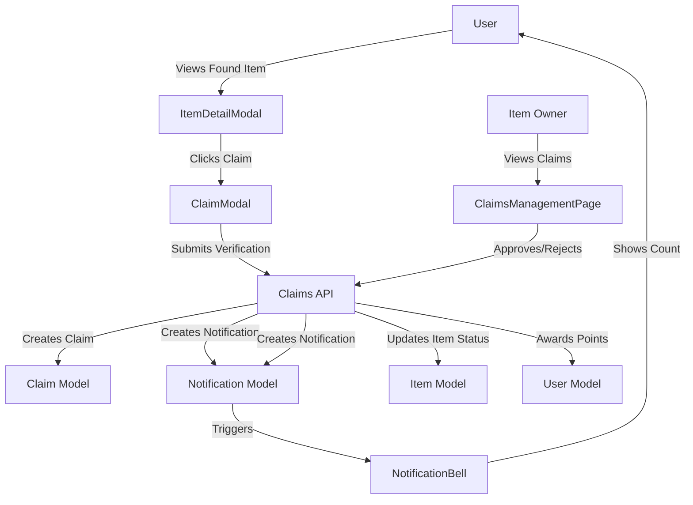
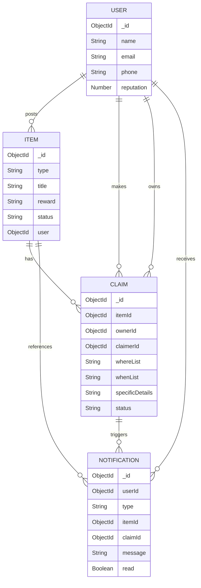

# Design Document: Complete Claims, Notifications, and Rewards System

## Overview

This design document specifies the technical implementation for a comprehensive claims, notifications, and rewards system for the Khoj Lost & Found application. The system enables users to claim found items through verification, receive real-time notifications, offer rewards for lost items, and earn reputation points.

### Goals

- Enable secure item claiming with verification questions
- Provide real-time notification system for claim activities
- Allow lost item owners to offer rewards as incentives
- Track user contributions through reputation points
- Fix university campus structure for multi-campus institutions
- Ensure premium UI/UX with smooth animations and responsive design

### Non-Goals

- Real-time WebSocket notifications (using polling instead)
- Push notifications to mobile devices
- Monetary transaction processing for cash rewards
- Advanced reputation leaderboards or gamification

## Architecture

### System Components

The system consists of three main layers:

1. **Backend API Layer**: Express.js routes handling claims, notifications, and reputation
2. **Data Layer**: MongoDB models with optimized indexes for performance
3. **Frontend Layer**: React components with state management and API integration

### Component Interaction Flow



### Data Flow

1. **Claim Submission Flow**:
   - User views found item → Opens claim modal → Fills verification questions → Submits claim
   - Backend validates ownership, duplicates → Creates claim record → Creates notification for owner
   - Owner receives notification → Views claim details → Approves or rejects

2. **Notification Flow**:
   - System event occurs (claim created/approved/rejected) → Notification created in database
   - NotificationBell polls for unread count every 30 seconds → Displays badge
   - User clicks bell → Navigates to NotificationsPage → Notifications marked as read

3. **Reward Display Flow**:
   - User posts lost item with reward → Reward stored in Item model
   - Home page displays reward badge → Detail modal shows premium reward section
   - Finder sees reward incentive → Contacts owner or waits for claim approval

## Components and Interfaces

### Backend Components

#### 1. Claims Routes (`server/src/routes/claimRoutes.js`)

**Existing Implementation**: Already complete with all required endpoints

**Endpoints**:
- `POST /claims` - Create new claim
- `GET /claims/item/:itemId` - Get claims for item (owner only)
- `GET /claims/mine` - Get user's claims
- `PUT /claims/:id/approve` - Approve claim (owner only)
- `PUT /claims/:id/reject` - Reject claim (owner only)

**Validation Logic**:
- Prevent self-claiming
- Prevent duplicate pending claims
- Verify ownership before approval/rejection
- Ensure claim is in pending status before processing

#### 2. Notifications Routes (`server/src/routes/notificationRoutes.js`)

**Existing Implementation**: Already complete with all required endpoints

**Endpoints**:
- `GET /notifications` - List all notifications
- `GET /notifications/unread` - Get unread count
- `PUT /notifications/:id/read` - Mark as read
- `PUT /notifications/read-all` - Mark all as read

#### 3. Reputation System

**Implementation**: Integrated into claims approval flow

**Logic**:
```javascript
// In claims approve endpoint
await User.findByIdAndUpdate(claim.claimerId, { $inc: { reputation: 10 } });
```

**Rules**:
- Award 10 points to claimer (finder) on approval
- No points for item owner
- No points for rejected claims
- Atomic increment using MongoDB $inc operator

### Frontend Components

#### 1. ClaimsManagementPage (NEW)

**Location**: `src/pages/dashboard/ClaimsManagement.jsx`

**Purpose**: Display and manage pending claims for items owned by current user

**State Management**:
```javascript
const [claims, setClaims] = useState([]);
const [loading, setLoading] = useState(true);
const [processingClaimId, setProcessingClaimId] = useState(null);
```

**Key Features**:
- Fetch claims for user's items on mount
- Display verification answers (whereList, whenList, specificDetails)
- Approve/reject buttons with loading states
- Reveal contact info after approval
- Error handling with user-friendly messages
- Empty state when no claims exist

**UI Layout**:
- Card-based layout for each claim
- Item thumbnail and title
- Claimer information section
- Verification answers in expandable sections
- Action buttons (approve/reject) with confirmation
- Contact reveal section after approval

#### 2. NotificationsPage (NEW)

**Location**: `src/pages/dashboard/Notifications.jsx`

**Purpose**: Display all notifications with read/unread status

**State Management**:
```javascript
const [notifications, setNotifications] = useState([]);
const [loading, setLoading] = useState(true);
const [markingAllRead, setMarkingAllRead] = useState(false);
```

**Key Features**:
- Fetch notifications on mount
- Auto-mark as read when viewed
- Visual distinction for unread notifications
- "Mark All as Read" button
- Link to claims management for claim_request notifications
- Display item details with notification
- Timestamp formatting with date-fns
- Empty state with friendly message

**Notification Types Display**:
- `claim_request`: "Someone is trying to claim your item" + link to claims page
- `claim_approved`: "Your claim has been approved! You earned +10 reputation points"
- `claim_rejected`: "Your claim has been rejected"
- `item_resolved`: "Your item has been marked as resolved"

#### 3. NotificationBell Enhancement

**Location**: `src/components/layout/Navbar.jsx`

**Current State**: Basic bell icon with static red dot

**Enhancements Needed**:
- Fetch unread count from API
- Display count badge dynamically
- Poll for updates every 30 seconds
- Navigate to notifications page on click
- Hide badge when count is zero
- Loading and error states

**Implementation**:
```javascript
const [unreadCount, setUnreadCount] = useState(0);

useEffect(() => {
  const fetchUnreadCount = async () => {
    try {
      const { count } = await NotificationsAPI.getUnreadCount();
      setUnreadCount(count);
    } catch (error) {
      console.error('Failed to fetch unread count', error);
    }
  };

  fetchUnreadCount();
  const interval = setInterval(fetchUnreadCount, 30000);
  return () => clearInterval(interval);
}, []);
```

#### 4. ClaimModal Enhancement

**Location**: `src/components/ui/ClaimModal.jsx`

**Current State**: Exists but needs verification

**Required Fields**:
- `whereList`: Text input for location details
- `whenList`: Text input for time details
- `specificDetails`: Textarea for additional proof

**Validation**:
- All three fields required before submission
- Minimum character lengths (e.g., 10 chars each)
- Clear error messages for validation failures

**UI Design**:
- Premium modal styling with backdrop blur
- Clear field labels and placeholders
- Character count indicators
- Submit button disabled until valid
- Success/error toast notifications

#### 5. Reward Display Components

**Locations**: 
- `src/pages/dashboard/Home.jsx` (item cards)
- `src/components/ui/ItemDetailModal.jsx` (detail view)
- `src/pages/dashboard/PostItem.jsx` (reward selection)

**Reward Badge Styling**:
```css
/* Premium gradient badge */
bg-gradient-to-r from-amber-50 to-yellow-50
border border-amber-200
rounded-full
px-3 py-1.5
shadow-sm
```

**Emoji Mappings**:
- gratitude: 🙏
- food_treat: 🍕
- coffee: ☕
- cash_reward: 💵
- gift: 🎁
- none: (no display)

**Detail Modal Reward Section**:
- Large gradient card with premium styling
- Prominent emoji icon (text-3xl)
- Reward type label
- Descriptive text: "The owner is offering [reward] for finding this item"

### API Client Integration

#### ClaimsAPI (NEW)

**Location**: `src/lib/apiClient.js`

**Methods**:
```javascript
export const ClaimsAPI = {
  create: async (data) => apiRequest('/claims', 'POST', data),
  getForItem: async (itemId) => apiRequest(`/claims/item/${itemId}`, 'GET'),
  getMine: async () => apiRequest('/claims/mine', 'GET'),
  approve: async (claimId) => apiRequest(`/claims/${claimId}/approve`, 'PUT'),
  reject: async (claimId) => apiRequest(`/claims/${claimId}/reject`, 'PUT'),
};
```

#### NotificationsAPI (NEW)

**Location**: `src/lib/apiClient.js`

**Methods**:
```javascript
export const NotificationsAPI = {
  list: async () => apiRequest('/notifications', 'GET'),
  getUnreadCount: async () => apiRequest('/notifications/unread', 'GET'),
  markAsRead: async (notificationId) => apiRequest(`/notifications/${notificationId}/read`, 'PUT'),
  markAllAsRead: async () => apiRequest('/notifications/read-all', 'PUT'),
};
```

## Data Models

### Existing Models (No Changes Needed)

#### Claim Model
```javascript
{
  itemId: ObjectId (ref: Item),
  ownerId: ObjectId (ref: User),
  claimerId: ObjectId (ref: User),
  whereList: String,
  whenList: String,
  specificDetails: String,
  status: enum['pending', 'approved', 'rejected'],
  timestamps: true
}
```

**Indexes**:
- `{ itemId: 1, status: 1 }`
- `{ ownerId: 1, status: 1 }`
- `{ claimerId: 1, status: 1 }`

#### Notification Model
```javascript
{
  userId: ObjectId (ref: User),
  type: enum['claim_request', 'claim_approved', 'claim_rejected', 'item_resolved'],
  itemId: ObjectId (ref: Item),
  claimId: ObjectId (ref: Item),
  message: String,
  read: Boolean,
  timestamps: true
}
```

**Indexes**:
- `{ userId: 1, read: 1, createdAt: -1 }`

#### Item Model
```javascript
{
  // ... existing fields
  reward: enum['gratitude', 'food_treat', 'coffee', 'cash_reward', 'gift', 'none'],
  status: enum['active', 'resolved'],
  // ... existing fields
}
```

#### User Model
```javascript
{
  // ... existing fields
  reputation: Number (default: 0),
  // ... existing fields
}
```

### Data Relationships



## User Flows

### Flow 1: Claiming a Found Item (End-to-End)

1. **Discovery Phase**:
   - User browses home page
   - Sees found item that matches their lost item
   - Clicks on item card to view details

2. **Claim Initiation**:
   - ItemDetailModal opens with full item details
   - User sees "Claim This Item" button (only for found items)
   - Clicks claim button

3. **Verification Phase**:
   - ClaimModal opens with three verification fields
   - User fills in:
     - Where they lost it (whereList)
     - When they lost it (whenList)
     - Specific details to prove ownership (specificDetails)
   - Validation ensures all fields are filled
   - User submits claim

4. **Backend Processing**:
   - API validates user is not the item owner
   - API checks for duplicate pending claims
   - Claim record created with status "pending"
   - Notification created for item owner

5. **Confirmation**:
   - Success message displayed to claimer
   - Modal closes
   - User can view claim status in their notifications

### Flow 2: Approving/Rejecting Claims

1. **Notification Receipt**:
   - Item owner sees unread count badge on notification bell
   - Clicks bell to view notifications
   - Sees "claim_request" notification

2. **Claims Review**:
   - Clicks link to Claims Management page
   - Views all pending claims for their items
   - Sees verification answers from claimer

3. **Decision Making**:
   - Owner reviews verification details
   - Compares with actual item details
   - Decides to approve or reject

4. **Approval Path**:
   - Clicks "Approve" button
   - Confirmation dialog appears
   - Confirms approval
   - Backend updates claim status to "approved"
   - Item status changed to "resolved"
   - Claimer awarded 10 reputation points
   - Notification sent to claimer
   - Contact information revealed to owner

5. **Rejection Path**:
   - Clicks "Reject" button
   - Confirmation dialog appears
   - Confirms rejection
   - Backend updates claim status to "rejected"
   - Notification sent to claimer
   - Claim removed from pending list

### Flow 3: Viewing Notifications

1. **Notification Awareness**:
   - User sees unread count badge on bell icon
   - Badge updates every 30 seconds via polling

2. **Navigation**:
   - User clicks notification bell
   - Navigates to Notifications page

3. **Viewing Notifications**:
   - All notifications displayed in chronological order
   - Unread notifications highlighted with background color
   - Each notification shows:
     - Type icon
     - Message text
     - Associated item title
     - Timestamp
     - Read status

4. **Interaction**:
   - User scrolls through notifications
   - Notifications automatically marked as read when viewed
   - User can click "Mark All as Read" button
   - For claim_request notifications, user can click link to claims page

### Flow 4: Offering Rewards for Lost Items

1. **Item Posting**:
   - User navigates to Post Item page
   - Selects "Lost" as item type
   - Fills in item details

2. **Reward Selection**:
   - Reward selection interface appears (only for lost items)
   - Six options displayed with icons:
     - 🙏 Gratitude
     - 🍕 Food Treat
     - ☕ Coffee
     - 💵 Cash Reward
     - 🎁 Gift
     - None
   - User selects desired reward
   - Reward stored in item record

3. **Display on Home Page**:
   - Lost item appears in feed
   - Premium reward badge displayed on item card
   - Badge shows emoji and reward type
   - Gradient styling attracts attention

4. **Display in Detail Modal**:
   - User clicks on lost item
   - Detail modal opens
   - Prominent reward section displayed
   - Large emoji icon with gradient background
   - Descriptive text about reward offering

5. **Finder Motivation**:
   - Finder sees reward incentive
   - More likely to contact owner
   - Uses contact buttons to reach out

## UI/UX Design

### Design Principles

1. **Premium Aesthetic**: Gradients, shadows, rounded corners, smooth animations
2. **Clear Hierarchy**: Important actions prominently displayed
3. **Responsive Design**: Mobile-first approach with touch-friendly targets
4. **Accessibility**: Proper contrast ratios, ARIA labels, keyboard navigation
5. **Performance**: Optimized images, lazy loading, efficient re-renders

### Color Palette

```javascript
// Tailwind CSS classes used
primary: 'from-primary-600 to-primary-800'
success: 'from-success-500 to-green-600'
warning: 'from-amber-400 to-orange-500'
danger: 'from-danger-500 to-red-600'
```

### Component Styling Guidelines

#### Notification Bell
- Icon size: w-5 h-5 (desktop), w-4 h-4 (mobile)
- Badge: absolute positioning, bg-danger-500, rounded-full
- Badge size: w-2 h-2 (minimum), larger with count number
- Hover state: bg-gray-100 transition

#### Reward Badges
- Background: `bg-gradient-to-r from-amber-50 to-yellow-50`
- Border: `border border-amber-200`
- Shape: `rounded-full`
- Padding: `px-3 py-1.5`
- Text: `text-xs font-semibold text-amber-800`
- Emoji size: `text-base`

#### Claim Cards
- Background: `bg-white`
- Border: `border-2 border-gray-200 hover:border-primary-300`
- Shadow: `shadow-md hover:shadow-lg`
- Padding: `p-4 sm:p-6`
- Rounded: `rounded-xl`

#### Action Buttons
- Primary: `bg-gradient-to-r from-success-500 to-green-600`
- Danger: `bg-gradient-to-r from-danger-500 to-red-600`
- Outline: `border-2 border-gray-300 hover:border-primary-500`
- Size: `px-4 py-2 sm:px-6 sm:py-3`
- Text: `text-sm sm:text-base font-semibold`

### Animation Specifications

#### Modal Animations (Framer Motion)
```javascript
initial={{ opacity: 0, scale: 0.95, y: 20 }}
animate={{ opacity: 1, scale: 1, y: 0 }}
exit={{ opacity: 0, scale: 0.95, y: 20 }}
transition={{ duration: 0.2 }}
```

#### Card Hover Animations
```javascript
transition-all duration-300
hover:scale-105
hover:shadow-xl
```

#### Badge Pulse (Urgent/Unread)
```css
animate-pulse
```

### Responsive Breakpoints

- Mobile: 320px - 640px (sm)
- Tablet: 640px - 1024px (md)
- Desktop: 1024px+ (lg)

**Mobile Optimizations**:
- Stack layouts vertically
- Increase touch target sizes (min 44px)
- Reduce padding and margins
- Hide non-essential information
- Bottom navigation for key actions

## State Management

### Component-Level State

Most state managed at component level using React hooks:

```javascript
// ClaimsManagementPage
const [claims, setClaims] = useState([]);
const [loading, setLoading] = useState(true);
const [error, setError] = useState('');
const [processingClaimId, setProcessingClaimId] = useState(null);

// NotificationsPage
const [notifications, setNotifications] = useState([]);
const [loading, setLoading] = useState(true);
const [markingAllRead, setMarkingAllRead] = useState(false);

// NotificationBell
const [unreadCount, setUnreadCount] = useState(0);
```

### Polling Strategy for Notifications

**Implementation**:
```javascript
useEffect(() => {
  const fetchUnreadCount = async () => {
    try {
      const { count } = await NotificationsAPI.getUnreadCount();
      setUnreadCount(count);
    } catch (error) {
      console.error('Failed to fetch unread count', error);
    }
  };

  fetchUnreadCount(); // Initial fetch
  const interval = setInterval(fetchUnreadCount, 30000); // Poll every 30s
  
  return () => clearInterval(interval); // Cleanup
}, []);
```

**Rationale**:
- Simple implementation without WebSocket complexity
- 30-second interval balances freshness with server load
- Automatic cleanup prevents memory leaks
- Graceful error handling doesn't disrupt user experience

### State Synchronization

**Challenge**: Keeping notification count in sync across components

**Solution**: Refresh notification count after key actions:
- After submitting a claim
- After approving/rejecting a claim
- After marking notifications as read
- After navigating to notifications page

**Implementation**:
```javascript
// In ClaimsManagementPage after approval
await ClaimsAPI.approve(claimId);
// Trigger notification count refresh in parent or via event
```

### Optimistic Updates

For better UX, implement optimistic updates:

```javascript
// Mark notification as read optimistically
const markAsRead = async (notificationId) => {
  // Update UI immediately
  setNotifications(prev => 
    prev.map(n => n._id === notificationId ? { ...n, read: true } : n)
  );
  
  try {
    await NotificationsAPI.markAsRead(notificationId);
  } catch (error) {
    // Revert on error
    setNotifications(prev => 
      prev.map(n => n._id === notificationId ? { ...n, read: false } : n)
    );
    showError('Failed to mark as read');
  }
};
```

## Error Handling

### Error Categories

1. **Validation Errors**: User input doesn't meet requirements
2. **Authorization Errors**: User doesn't have permission
3. **Not Found Errors**: Resource doesn't exist
4. **Conflict Errors**: Duplicate or invalid state
5. **Server Errors**: Backend failures

### Error Display Strategy

#### Toast Notifications
For transient errors and success messages:
```javascript
// Success
toast.success('Claim submitted successfully!');

// Error
toast.error('Failed to submit claim. Please try again.');
```

#### Inline Error Messages
For form validation:
```javascript
{errors.whereList && (
  <p className="text-sm text-danger-600 mt-1">{errors.whereList}</p>
)}
```

#### Error States
For page-level errors:
```javascript
{error && (
  <Card className="p-4 border border-danger-200 bg-danger-50">
    <p className="text-danger-700">{error}</p>
    <Button onClick={retry} className="mt-2">Retry</Button>
  </Card>
)}
```

### Specific Error Scenarios

#### 1. Claim Submission Errors

**Scenario**: User tries to claim their own item
```javascript
// Backend response
{ message: 'You cannot claim your own item' }

// Frontend handling
catch (error) {
  if (error.message.includes('own item')) {
    setError('You cannot claim your own item');
  } else {
    setError('Failed to submit claim. Please try again.');
  }
}
```

**Scenario**: Duplicate claim attempt
```javascript
// Backend response
{ message: 'You already have a pending claim for this item' }

// Frontend handling
setError('You already have a pending claim for this item');
```

#### 2. Claims Processing Errors

**Scenario**: Claim already processed
```javascript
// Backend response
{ message: 'Claim already processed' }

// Frontend handling
toast.error('This claim has already been processed');
// Refresh claims list
fetchClaims();
```

#### 3. Notification Errors

**Scenario**: Failed to fetch notifications
```javascript
catch (error) {
  setError('Failed to load notifications');
  setLoading(false);
}

// Display retry option
<Button onClick={fetchNotifications}>Retry</Button>
```

**Scenario**: Failed to mark as read
```javascript
// Fail silently or show subtle message
console.error('Failed to mark as read', error);
// Don't disrupt user experience
```

### Graceful Degradation

#### Notification Bell
- If unread count fails to fetch, hide badge (don't show error)
- Continue polling in background
- User can still navigate to notifications page

#### Claims Management
- If claims fail to load, show error with retry button
- Don't block other page functionality
- Cache last successful fetch

#### Reward Display
- If reward field is missing or invalid, don't display badge
- Don't break item card rendering
- Log error for debugging

### Error Logging

All errors logged to console for debugging:
```javascript
console.error('Create claim error', error);
console.error('Failed to fetch notifications', error);
```

Production environment should integrate with error tracking service (e.g., Sentry).


## Correctness Properties

*A property is a characteristic or behavior that should hold true across all valid executions of a system-essentially, a formal statement about what the system should do. Properties serve as the bridge between human-readable specifications and machine-verifiable correctness guarantees.*

### Property Reflection

After analyzing all acceptance criteria, I identified several areas where properties can be consolidated:

**Redundancy Analysis**:
1. Properties about notification creation (2.7, 3.7, 3.10, 6.2, 6.3, 6.4) can be consolidated into a single property about notification creation on claim events
2. Properties about API method existence (10.1-10.5, 11.1-11.4) are implementation details better tested as examples
3. Properties about contact button display (4.3, 4.4) can be combined into one property about contactPreference mapping
4. Properties about claim status updates (3.4, 3.9) can be combined into one property about status transitions
5. Properties about MongoDB optimization (15.4-15.7) are infrastructure concerns, not functional properties

**Consolidated Properties**:
- Combined notification creation properties into one comprehensive property
- Combined contact preference properties into one mapping property
- Combined claim status transition properties
- Removed redundant API interface properties (tested as examples instead)
- Removed infrastructure optimization properties (verified through performance testing)

### Property 1: Claim Creation Validation

*For any* user and found item, when the user attempts to create a claim, the system should reject the claim if the user is the item owner OR if the user already has a pending claim for that item.

**Validates: Requirements 2.5, 2.6**

### Property 2: Claim Record Completeness

*For any* successfully created claim, the claim record should contain all required fields: itemId, ownerId, claimerId, whereList, whenList, specificDetails, and status "pending".

**Validates: Requirements 2.4, 2.8**

### Property 3: Notification Creation on Claim Events

*For any* claim event (creation, approval, rejection), the system should create exactly one notification for the appropriate recipient with the correct type and message.

**Validates: Requirements 2.7, 3.7, 3.10, 6.2, 6.3, 6.4**

### Property 4: Claim Approval Side Effects

*For any* approved claim, the system should: (1) update claim status to "approved", (2) update item status to "resolved", (3) increment claimer's reputation by exactly 10 points, (4) create a claim_approved notification, and (5) NOT change the owner's reputation.

**Validates: Requirements 3.4, 3.5, 3.6, 3.7, 9.1, 9.2, 9.7**

### Property 5: Claim Rejection Side Effects

*For any* rejected claim, the system should: (1) update claim status to "rejected", (2) create a claim_rejected notification, and (3) NOT change any reputation values.

**Validates: Requirements 3.9, 3.10, 9.7**

### Property 6: Claim Processing Authorization

*For any* claim approval or rejection attempt, the system should reject the operation if the requesting user is not the item owner OR if the claim status is not "pending".

**Validates: Requirements 3.11**

### Property 7: Contact Preference Mapping

*For any* lost item, the contact buttons displayed should match the contactPreference field: "email" shows email button only, "phone" shows phone button only, "both" shows both buttons.

**Validates: Requirements 4.2, 4.3, 4.4**

### Property 8: Contact Link Format

*For any* contact button, the href attribute should use the correct protocol: email buttons should use "mailto:" with the owner's email, phone buttons should use "tel:" with the owner's phone number.

**Validates: Requirements 4.5, 4.6**

### Property 9: Reward Emoji Mapping

*For any* reward value (gratitude, food_treat, coffee, cash_reward, gift), the displayed emoji should match the specified mapping: gratitude→🙏, food_treat→🍕, coffee→☕, cash_reward→💵, gift→🎁.

**Validates: Requirements 5.4**

### Property 10: Reward Display Conditional

*For any* item, a reward badge should be displayed if and only if the item type is "lost" AND the reward value is not "none".

**Validates: Requirements 5.3, 5.5, 5.7**

### Property 11: Notification Type Validation

*For any* notification creation attempt, the system should accept only the four valid types (claim_request, claim_approved, claim_rejected, item_resolved) and reject any other type.

**Validates: Requirements 6.1**

### Property 12: Notification Default State

*For any* newly created notification, the read status should be false by default.

**Validates: Requirements 6.6**

### Property 13: Unread Count Accuracy

*For any* user, the unread notification count returned by the API should equal the number of notifications where userId matches and read status is false.

**Validates: Requirements 6.7**

### Property 14: Mark As Read Operation

*For any* notification, calling the mark-as-read endpoint should update the read status to true if and only if the requesting user is the notification owner.

**Validates: Requirements 6.8**

### Property 15: Mark All As Read Operation

*For any* user, calling the mark-all-as-read endpoint should update all notifications where userId matches and read is false to have read status true.

**Validates: Requirements 6.9**

### Property 16: Notification Sorting

*For any* list of notifications returned by the API, the notifications should be sorted by createdAt timestamp in descending order (newest first).

**Validates: Requirements 6.10**

### Property 17: Notification Bell Badge Display

*For any* unread count value, the notification bell should display a badge with the count number if count > 0, and should NOT display a badge if count = 0.

**Validates: Requirements 7.3, 7.4**

### Property 18: Notification Bell Polling

*For any* mounted notification bell component, the system should fetch the unread count on mount and then at 30-second intervals until the component unmounts.

**Validates: Requirements 7.5**

### Property 19: Claims Display Filtering

*For any* user viewing the claims management page, only claims where the user is the item owner AND the claim status is "pending" should be displayed.

**Validates: Requirements 3.1**

### Property 20: Verification Fields Display

*For any* displayed claim, all three verification fields (whereList, whenList, specificDetails) should be visible to the item owner.

**Validates: Requirements 3.2**

### Property 21: Reputation Initialization

*For any* newly created user, the reputation field should be initialized to 0.

**Validates: Requirements 9.6**

### Property 22: Reputation Atomic Increment

*For any* concurrent claim approvals for different items by the same claimer, the final reputation value should equal the initial reputation plus 10 times the number of approvals (no lost updates).

**Validates: Requirements 9.4**

### Property 23: Campus Selector Options

*For any* university with N campuses, the campus selector should display exactly N campus options when that university is selected.

**Validates: Requirements 1.2**

### Property 24: Item Storage References

*For any* posted item, the stored record should contain universityId and campusId as ObjectId types (not strings).

**Validates: Requirements 1.4**

### Property 25: Item Display Cache Usage

*For any* displayed item, the UI should render the cached universityName and campusName string fields, not the ObjectId references.

**Validates: Requirements 1.5**

### Property 26: Found Item Claim Button

*For any* found item displayed in the detail modal, a "Claim This Item" button should be present.

**Validates: Requirements 2.1**

### Property 27: Lost Item Contact Section

*For any* lost item displayed in the detail modal, a "Contact Owner" section should be present.

**Validates: Requirements 4.1**

### Property 28: Claim Modal Validation

*For any* claim submission attempt, the system should reject the submission if any of the three verification fields (whereList, whenList, specificDetails) are empty or contain only whitespace.

**Validates: Requirements 2.3**

### Property 29: Error Message Specificity

*For any* claim submission error, the system should display the specific error message from the server (e.g., "You cannot claim your own item", "You already have a pending claim for this item") rather than a generic error.

**Validates: Requirements 14.3, 14.4, 14.5**

### Property 30: Notification Bell Polling Interval

*For any* notification bell component, the time between consecutive API calls for unread count should be at least 30 seconds (to prevent excessive API calls).

**Validates: Requirements 15.1**

## Testing Strategy

### Dual Testing Approach

This feature requires both unit tests and property-based tests for comprehensive coverage:

**Unit Tests**: Focus on specific examples, edge cases, and integration points
- Specific claim scenarios (own item, duplicate claim)
- Specific notification messages
- UI component rendering with specific props
- API error responses
- Edge cases (empty fields, invalid IDs, missing data)

**Property-Based Tests**: Verify universal properties across all inputs
- Claim validation logic with random users and items
- Notification creation with random claim events
- Reputation calculations with random approval sequences
- Contact preference mapping with random preference values
- Reward emoji mapping with random reward types

### Property-Based Testing Configuration

**Library Selection**: 
- Backend (Node.js): Use `fast-check` library
- Frontend (React): Use `fast-check` with React Testing Library

**Test Configuration**:
- Minimum 100 iterations per property test
- Each test tagged with feature name and property number
- Tag format: `Feature: complete-claims-notifications-rewards, Property {number}: {property_text}`

**Example Property Test Structure**:
```javascript
// Backend property test example
const fc = require('fast-check');

describe('Feature: complete-claims-notifications-rewards, Property 1: Claim Creation Validation', () => {
  it('should reject claims when user is owner or has pending claim', async () => {
    await fc.assert(
      fc.asyncProperty(
        fc.record({
          userId: fc.string(),
          itemOwnerId: fc.string(),
          hasPendingClaim: fc.boolean(),
        }),
        async ({ userId, itemOwnerId, hasPendingClaim }) => {
          // Setup test data
          const shouldReject = userId === itemOwnerId || hasPendingClaim;
          
          // Execute claim creation
          const result = await attemptClaimCreation(userId, itemOwnerId, hasPendingClaim);
          
          // Verify property
          if (shouldReject) {
            expect(result.success).toBe(false);
            expect(result.error).toBeDefined();
          }
        }
      ),
      { numRuns: 100 }
    );
  });
});
```

### Test Coverage Goals

**Backend API Tests**:
- Claims routes: 100% coverage of all endpoints
- Notification routes: 100% coverage of all endpoints
- Validation logic: All error paths tested
- Side effects: All cascading updates verified

**Frontend Component Tests**:
- ClaimsManagementPage: All user interactions tested
- NotificationsPage: All display states tested
- NotificationBell: Polling and display logic tested
- ClaimModal: Form validation and submission tested
- Reward display: All conditional rendering tested

**Integration Tests**:
- End-to-end claim flow (submission → approval → notification)
- End-to-end rejection flow
- Notification polling and display
- Reputation point calculation
- Contact system for lost items

### Testing Tools

**Backend**:
- Jest: Test runner
- Supertest: API endpoint testing
- fast-check: Property-based testing
- MongoDB Memory Server: In-memory database for tests

**Frontend**:
- Vitest: Test runner
- React Testing Library: Component testing
- fast-check: Property-based testing
- MSW (Mock Service Worker): API mocking

### Test Data Generation

**Generators for Property Tests**:
```javascript
// User generator
const userGen = fc.record({
  _id: fc.hexaString({ minLength: 24, maxLength: 24 }),
  name: fc.string({ minLength: 1, maxLength: 50 }),
  email: fc.emailAddress(),
  reputation: fc.nat({ max: 10000 }),
});

// Item generator
const itemGen = fc.record({
  _id: fc.hexaString({ minLength: 24, maxLength: 24 }),
  type: fc.constantFrom('found', 'lost'),
  title: fc.string({ minLength: 1, maxLength: 100 }),
  reward: fc.constantFrom('gratitude', 'food_treat', 'coffee', 'cash_reward', 'gift', 'none'),
  status: fc.constantFrom('active', 'resolved'),
  user: fc.hexaString({ minLength: 24, maxLength: 24 }),
});

// Claim generator
const claimGen = fc.record({
  itemId: fc.hexaString({ minLength: 24, maxLength: 24 }),
  ownerId: fc.hexaString({ minLength: 24, maxLength: 24 }),
  claimerId: fc.hexaString({ minLength: 24, maxLength: 24 }),
  whereList: fc.string({ minLength: 10, maxLength: 200 }),
  whenList: fc.string({ minLength: 10, maxLength: 200 }),
  specificDetails: fc.string({ minLength: 10, maxLength: 500 }),
  status: fc.constantFrom('pending', 'approved', 'rejected'),
});
```

### Performance Testing

**Load Testing Scenarios**:
- 100 concurrent claim submissions
- 1000 notification fetches per minute
- Notification bell polling from 500 active users
- Claims management page with 100+ pending claims

**Performance Benchmarks**:
- Claim creation: < 200ms
- Notification fetch: < 100ms
- Unread count query: < 50ms
- Claim approval (with all side effects): < 300ms

### Continuous Integration

**CI Pipeline**:
1. Run all unit tests
2. Run all property-based tests (100 iterations each)
3. Run integration tests
4. Check code coverage (minimum 80%)
5. Run linting and type checking
6. Build frontend and backend
7. Deploy to staging environment

**Test Execution Order**:
1. Fast unit tests first (< 1s each)
2. Property-based tests second (< 10s each)
3. Integration tests last (< 30s each)

